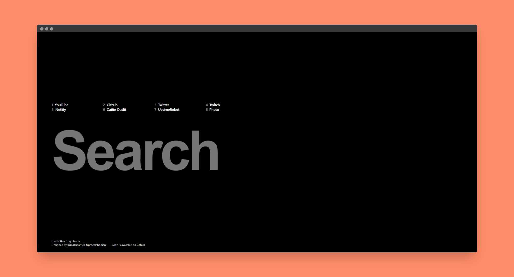

# Minimal Startpage

[](https://app.netlify.com/sites/vermillion-kangaroo-91a62e/deploys)

Very simple page for web browser startpage or homepage.
Built with Astro and TailwindCSS.
The favicon is from Iconmonstr.



## Project Structure

Inside of your Astro project, you'll see the following folders and files:

```text
/
├── public/
│   └── icon.svg
├── src/
│   ├── components/
│   │   └── FooterSection.astro
│   │   └── LinkSection.astro
│   │   └── SearchSection.astro
│   ├── layouts/
│   │   └── Layout.astro
│   └── pages/
│       └── index.astro
└── package.json
```

Any static assets, like images, can be placed in the `public/` directory.

If you're looking to modify the quick links, edit `const` at the top of `LinkSection.astro` file.

## Commands

All commands are run from the root of the project, from a terminal:

| Command                   | Action                                           |
| :------------------------ | :----------------------------------------------- |
| `npm install`             | Installs dependencies                            |
| `npm run dev`             | Starts local dev server at `localhost:4321`      |
| `npm run build`           | Build your production site to `./dist/`          |
| `npm run preview`         | Preview your build locally, before deploying     |
| `npm run astro ...`       | Run CLI commands like `astro add`, `astro check` |
| `npm run astro -- --help` | Get help using the Astro CLI                     |
