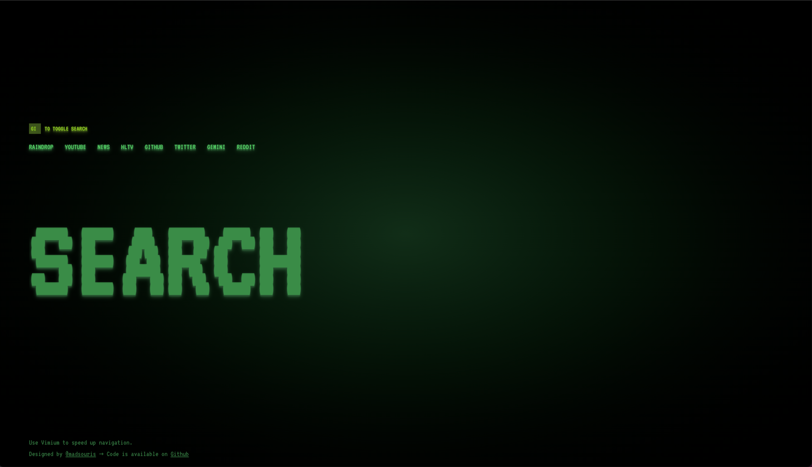

# Minimal Startpage

Very simple page for web browser startpage or homepage.
Built with Vitejs, Vue, TailwindCSS.
The favicon is from Iconmonstr.

# Features

-   Hotkeys to open links faster
-   PWA for faster interaction, cache, and installable
-   Google search with Alt+K
-   Easy dev setup with Vitejs + Vue + UnoCSS

## Hot key

-   `Alt + 1` to `Alt + 8` go to each link respectively
-   `Alt + K` to focus search input (Google)

## How to edit

### Links

You might wanna look at `LinkSection.vue` in `/src/components` First.
`links` object is read from `/src/data.json` file, so please edit your links there.

## How to setup my browser to open the page on load and new tab?

-   You can set your custom startpage URL as homepage. And set browser startup to open homepage.
-   Use extension like New Page Redirect to open custom URL when open new tab.

## Recommended IDE Setup

-   [VS Code](https://code.visualstudio.com/) + [Volar](https://marketplace.visualstudio.com/items?itemName=Vue.volar)

## Before you run

You gonna need Nodejs installed, latest is recommended.

## Dependencies

-   Tinykeys (https://github.com/jamiebuilds/tinykeys)
-   Vue 3
-   Vitejs
-   TailwindCSS

## How to run

-   Clone this repo
-   Open terminal and `cd startpage`
-   Install dependencies `npm install `
-   Finally run using `npm run dev`

## Build

-   Run `npm run build`

## Enjoy! and help me correct spaghetti code. :(
